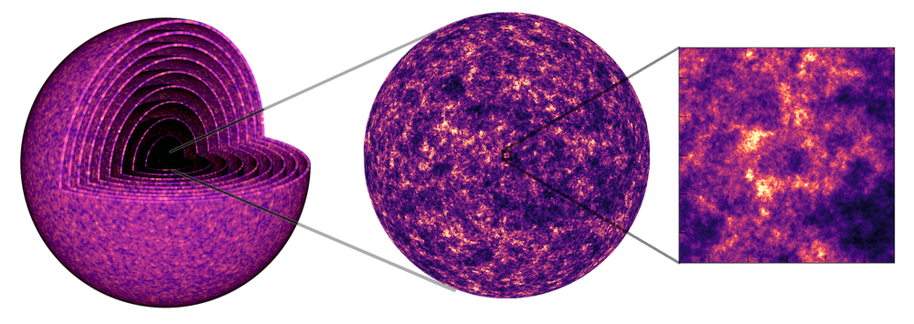

## Me

- Natural Sciences at University of Cambridge (Astrophysics).
- CDT in Data Intensive Science, UCL.
- Senior RSE at Advanced Research Computing (ARC), UCL.
- Five years and counting…
- Worked on this project for two years on and off.
- Enjoy running .

# GLASS: Generator for Large Scale Structure

## Overview

::: {layout-nrow="2"}

::: {.cell}

[GLASS](https://glass.readthedocs.io) is a code used in cosmology to generate
simulations of the full observable universe. In its current form, the primary
user base of the code are collaborations for large galaxy surveys, which are a
cornerstone of modern cosmology.

:::

::: {.cell}

{fig-alt="A three-part diagram of the GLASS code
simulation process. Left-to-right the diagram shows nested spherical shells of
the universe, a full-sky projection of cosmic matter density, and a
high-resolution zoomed-in view of density fluctuations."}

:::

:::

## The Team

::: {layout-ncol="4"}

::: {.fragment}

 (Principal Investigator + Technical Staff)](https://github.com/ntessore.png){fig-alt="Nicolas
Tessore"}

:::

::: {.fragment}

 (Technical Staff)](https://github.com/connoraird.png){fig-alt="Connor
Aird"}

:::

::: {.fragment}

 (Technical Staff)](https://github.com/saransh-cpp.png){fig-alt="Saransh
Chopra"}

:::

::: {.fragment}

Me (Co-Investigator + Technical Staff) 

:::

:::

::: {style="font-size: 50%; margin-top: -2em;"}

- Co-Investigators: Alessio Spurio Mancini, Arthur Loureiro, Benjamin Joachimi,
  Jason McEwen, Niall Jeffrey.
- Research Administration: Rebecca Martin.

:::


