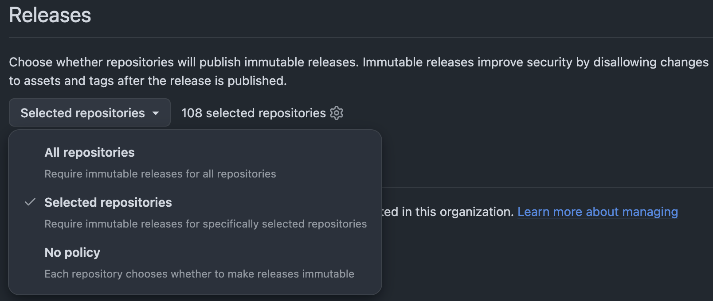
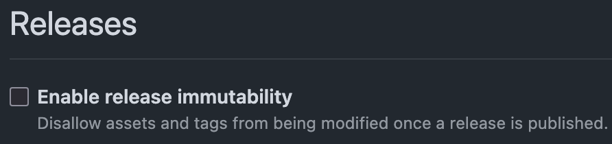

# Introduction

## GitHub Actions {footer=false}

```{.yaml code-line-numbers="|3-4|6|12|15|"}
name: Check pull request

on:
  pull_request_target:

permissions: write-all

jobs:
  check:
    runs-on: ubuntu-latest
    steps:
      - uses: actions/checkout@v7

      - name: Print pull request title
        run: echo "${{ github.event.pull_request.title }}"
```

::: {layout-ncol="2"}

::: {.cell}

- Dangerous triggers.
- Excessive permissions.
- Mutable dependency.

:::

::: {.cell}

- Persistent credentials.
- Template injection.

:::

:::

## The Problem

::: {.fragment .fade-in-then-semi-out}

A GitHub Actions workflow is an executable program, security-sensitive program,
not just configuration. A compromised step can have access to secrets,
repository contents and a write-capable `GITHUB_TOKEN`.

:::

::: {.fragment}

Teams carefully review hundreds of lines of Python, then approve a twenty-line
workflow without much thought.

:::

## A Workflow Security Model

```{mermaid}
%%| fig-align: center
%%| fig-alt: Flowchart showing a workflow security model to adopt.
flowchart LR
  A(Untrusted inputs) --> B("Workflow<br/>expressions and<br/>shell commands")
  B --> C("Third-party<br/>code and<br/>build tools")
  C --> D("Tokens, secrets,<br/>caches and release<br/>artefacts")
```

1. What <span style="color:green;">code</span> are we running?
2. Who controls its <span style="color:green;">inputs</span>?
3. What <span style="color:green;">authority</span> does it have?
4. What <span style="color:green;">state</span> can it read, modify or publish?

## Zizmor {footer=false}

::: {.fragment .fade-in-then-semi-out}

[zizmor](https://github.com/zizmorcore/zizmor) 
statically analyses the workflow definition to find dangerous relationships
between these things, without needing to run the workflow.

:::

::: {.fragment .fade-in-then-semi-out}

It analyses GitHub Actions workflows and action definitions, reporting issues
such as template injection, persisted credentials, excessive permissions and
unsafe Git references.

:::

- YAML parser: validates YAML syntax.
- Schema validator: validates GitHub Actions syntax.
- `zizmor`: checks for possible workflow exploitation.

# Dependencies

## Mutable References {data-menu-title="Mutable References (i)"}

::: {.fragment .fade-in-then-semi-out}

A common way to use a GitHub Action is to reference its moving major-version
tag. At the time of writing, `v7` identifies the latest `v7` release.

```{.yaml code-line-numbers="false"}
- uses: actions/checkout@v7
```

:::

::: {.fragment .fade-in-then-semi-out}

A more specific approach is to reference the individual patch release. These
references resolve to the same release **today**.

```{.yaml code-line-numbers="false"}
- uses: actions/checkout@v7.0.1
```

:::

::: {.fragment .fade-in-then-semi-out}

Later, the same unchanged reference might resolve to a new patch release.

```{.yaml code-line-numbers="false"}
- uses: actions/checkout@v7
```

`v7` → `v7.0.2`

:::

## Mutable References {data-menu-title="Mutable References (ii)"}

::: {.fragment}

- `v7` and `v7.0.1` currently resolve to the same commit.
- `v7` is a moving compatibility tag.
- A release-specific tag could be protected by an immutable release.
- A full SHA identifies the exact Git object without relying on the publisher's
  tag policy.

:::

::: {.fragment}

```{.yaml code-line-numbers="false"}
- uses: actions/checkout@3d3c42e5aac5ba805825da76410c181273ba90b1 # v7.0.1
```

The exact Git commit being executed is now explicit.

::: {.callout-important}

A full SHA is not automatically trustworthy. Verify that it exists in the
action's original repository and was not copied from a fork.

:::

:::

## Immutable Releases {data-menu-title="Immutable Releases (i)"}

::: {.fragment .fade-in-then-semi-out}

An
[immutable GitHub release](https://docs.github.com/en/code-security/concepts/supply-chain-security/immutable-releases)
protects its associated tag from being moved or deleted and prevents release
assets from being modified. It also creates a release attestation covering the
tag, commit SHA and assets.

:::

::: {.fragment .fade-in-then-semi-out}

Immutable releases protect what the **publisher** releases; SHA pinning records
exactly what the **consumer** has reviewed and chosen to run.

:::

## Immutable Releases {data-menu-title="Immutable Releases (ii)"}

1. Organisation (`Settings` → `Repository` → `General` → `Releases`)

   {fig-alt="Enabling immutable releases
   for a GitHub organisation."}

## Immutable Releases {data-menu-title="Immutable Releases (iii)"}

2. Repository (`Settings` → `General` → `Releases`)

   {fig-alt="Enabling immutable releases
   for a GitHub repository."}

::: {.fragment}

Since adopting immutable releases,
[astral-sh/setup-uv](https://github.com/astral-sh/setup-uv)
 has stopped publishing moving major-version tags. It
publishes `v9.0.0`, for example, but no moving `v9` tag.

:::

## Pinact: Automated Action Pinning

[pinact](https://github.com/suzuki-shunsuke/pinact)  is
a CLI tool that converts tagged action references to full SHAs while retaining a
human-readable version comment. It can also check whether references are pinned,
update them and verify that version annotations match their SHAs.
Dependency-update tools such as
[Renovate](https://github.com/renovatebot/renovate) can then maintain these
pinned references.

::: {.fragment}

```{.sh code-line-numbers="false"}
pinact run          # Pin existing references
pinact run -update  # Update actions to newer releases
```

:::

## Rule: `unpinned-uses` {footer=false}

By default, [unpinned-uses](https://docs.zizmor.sh/audits/#unpinned-uses)
requires all actions to be pinned to a full commit SHA, although this policy can
be configured for trusted repositories or namespaces.

Related rules:

::: {layout-ncol="2"}

::: {.cell}

### Reference integrity

- [impostor-commit](https://docs.zizmor.sh/audits/#impostor-commit)
- [ref-confusion](https://docs.zizmor.sh/audits/#ref-confusion)
- [ref-version-mismatch](https://docs.zizmor.sh/audits/#ref-version-mismatch)
- [typosquat-uses](https://docs.zizmor.sh/audits/#typosquat-uses)

:::

::: {.cell}

### Dependency health

- [archived-uses](https://docs.zizmor.sh/audits/#archived-uses)
- [known-vulnerable-actions](https://docs.zizmor.sh/audits/#known-vulnerable-actions)
- [stale-action-refs](https://docs.zizmor.sh/audits/#stale-action-refs)

:::

:::

# Authority

## Permissions Are Part of the Program

::: {.fragment .fade-in-then-semi-out}

Broad permissions increase the potential impact of a compromised step.

```{.yaml code-fold="false"}
permissions: write-all  # Introduces a broadly privileged GITHUB_TOKEN
```

:::

::: {.fragment}

Deny permissions by default at workflow level, then grant each job only what it
needs.

```{.yaml}
permissions: {}  # Disables default permissions

jobs:
  release:
    permissions:
      contents: write  # Needed to create the release

  test:
    permissions:
      contents: read
```

:::

## Rule: `excessive-permissions`

Permissions should describe what the job does, rather than what it might
conceivably need.

The following rules can help with this:

- [excessive-permissions](https://docs.zizmor.sh/audits/#excessive-permissions)
- [github-app](https://docs.zizmor.sh/audits/#github-app)
- [overprovisioned-secrets](https://docs.zizmor.sh/audits/#overprovisioned-secrets)
- [secrets-inherit](https://docs.zizmor.sh/audits/#secrets-inherit)
- [undocumented-permissions](https://docs.zizmor.sh/audits/#undocumented-permissions)

# Untrusted Inputs

## Template Injection

::: {.fragment .fade-in-then-semi-out}

The expression is expanded while GitHub is constructing the temporary shell
prompt script. It is not equivalent to safely passing an ordinary string
argument.

```{.yaml}
run: echo "${{ github.event.pull_request.title }}"
```

:::

::: {.fragment}

GitHub recommends using an intermediate environment variable for untrusted
context values used by inline scripts.

```{.yaml}
- name: Print pull request title
  env:
    PR_TITLE: ${{ github.event.pull_request.title }}
  run: printf '%s\n' "$PR_TITLE"
```

:::

## Rule: `template-injection`

Keep data as data. Do not accidentally turn it into shell prompt syntax.

Relevant rules:

- [github-env](https://docs.zizmor.sh/audits/#github-env)
- [insecure-commands](https://docs.zizmor.sh/audits/#insecure-commands)
- [obfuscation](https://docs.zizmor.sh/audits/#obfuscation)
- [secrets-outside-env](https://docs.zizmor.sh/audits/#obfuscation)
- [template-injection](https://docs.zizmor.sh/audits/#template-injection)
- [unredacted-secrets](https://docs.zizmor.sh/audits/#unredacted-secrets)

# Trust Boundaries

## Events Are Not Merely Scheduling

```{.yaml}
on:
  pull_request_target:
```

Triggers determine much more than when the workflow runs, including:

- which repository context is used;
- which workflow definition is loaded;
- what token permissions are available;
- whether the triggering party can influence inputs or checked-out code.

## Rule: `dangerous-triggers`

GitHub advises avoiding `pull_request_target` where it is unnecessary and warns
against combining privileged triggers with untrusted pull-request code.

Relevant rules:

- [bot-conditions](https://docs.zizmor.sh/audits/#bot-conditions)
- [dangerous-triggers](https://docs.zizmor.sh/audits/#dangerous-triggers)
- [self-hosted-runner](https://docs.zizmor.sh/audits/#self-hosted-runner)
- [unsound-condition](https://docs.zizmor.sh/audits/#unsound-condition)
- [unsound-contains](https://docs.zizmor.sh/audits/#unsound-contains)

# Persistent State

## Credentials Survive

::: {.fragment .fade-in-then-semi-out}

Rather than simply doing this.

```{.yaml code-line-numbers="false"}
- uses: actions/checkout@3d3c42e5aac5ba805825da76410c181273ba90b1 # v7.0.1
```

:::

::: {.fragment}

Unless later Git operations genuinely require credentials, better to disable the
unwanted credentials after checkout.

```{.yaml code-line-numbers="false"}
- uses: actions/checkout@3d3c42e5aac5ba805825da76410c181273ba90b1 # v7.0.1
  with:
    persist-credentials: false
```

:::

## Rule: `artipacked` {footer=false}

A release workflow should build from reviewed source and locked dependencies,
not from mutable cache state supplied by an earlier, less-trusted workflow.

Related rules:

- [adhoc-packages](https://docs.zizmor.sh/audits/#adhoc-packages)
- [artipacked](https://docs.zizmor.sh/audits/#artipacked)
- [cache-poisoning](https://docs.zizmor.sh/audits/#cache-poisoning)
- [unpinned-images](https://docs.zizmor.sh/audits/#unpinned-images)
- [unpinned-tools](https://docs.zizmor.sh/audits/#unpinned-tools)
- [use-trusted-publishing](https://docs.zizmor.sh/audits/#use-trusted-publishing)


